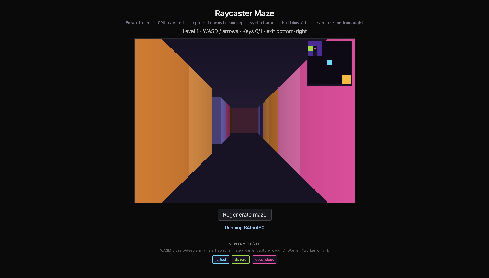
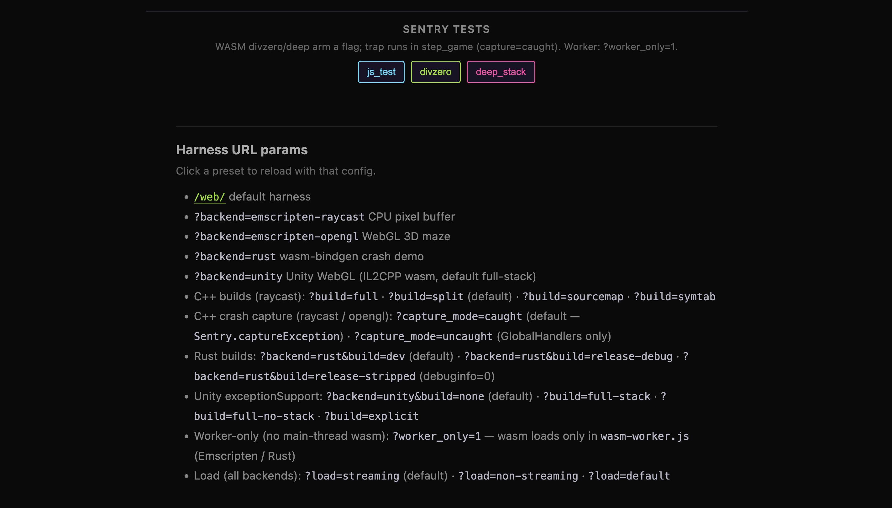

# WASM demos · Sentry

Multi-backend harness for testing `@sentry/browser` + `@sentry/wasm` across WASM toolchains.
Same page, same crash buttons — swap backend and load path via URL.

**Backends:** Emscripten CPU raycast maze · Emscripten WebGL 3D maze · Rust wasm-bindgen · Unity WebGL (IL2CPP)



## Quick start

```bash
npm install && (cd web && npm install)   # released @sentry/* + sentry-cli
source /path/to/emsdk/emsdk_env.sh       # per shell, or emcc is not found
make harness                             # builds every backend + the JS bundle
python3 -m http.server 8080
```

Open [http://localhost:8080/web/](http://localhost:8080/web/), click **WASM deep crash**, read the stack in the console. Hard-refresh after every rebuild.

That's enough to play and see stacks locally. To get Sentry Issues, see [Send to Sentry](#send-to-sentry).

## Install

| Tool | Needed for | Install |
| ---- | ---------- | ------- |
| Node 20+ | JS bundle, uploads | [nodejs.org](https://nodejs.org) |
| [emsdk](https://emscripten.org/docs/getting_started/downloads.html) | both Emscripten backends | `source /path/to/emsdk/emsdk_env.sh` |
| Rust + `wasm-pack` | `?backend=rust` | [rustup.rs](https://rustup.rs), then `cargo install wasm-pack` |
| `wasm-split` | Rust `*-symbols` targets | `cargo install wasm-split --git https://github.com/getsentry/symbolicator.git wasm-split` |
| Unity editor | `?backend=unity` | [backends/unity/README.md](backends/unity/README.md) |

Everything Sentry-side is a released npm package — `@sentry/browser` + `@sentry/wasm` in
[web/package.json](web/package.json), `@sentry/cli` in [package.json](package.json). No SDK or CLI
checkout needed.

## Send to Sentry

```bash
cp web/.env.example web/.env      # SENTRY_DSN, SENTRY_AUTH_TOKEN, SENTRY_ORG, SENTRY_PROJECT
cd web && npm run build:js && cd ..   # the DSN is baked into app.js at build time
npm run upload:debug-wasm         # debug wasm for every built backend
npm run upload:sourcemaps         # JS source maps for harness frames
```

The DSN alone is enough to **see** issues. Uploading debug files is what turns wasm addresses into
function names. Success looks like `UPLOADED ... (maze.split.debug.wasm; wasm32 library)`.

Re-upload after every wasm rebuild — `debug_id` changes on each build.

## Harness URL params



| Param | Values | Default | Needs |
| ----- | ------ | ------- | ----- |
| `backend` | `emscripten-raycast`, `emscripten-opengl`, `rust`, `unity` | `emscripten-raycast` | backend build |
| `build` | raycast `full`/`split`/`sourcemap`/`symtab`; rust `dev`/`release-debug`/`release-stripped`; unity `full-stack`/`full-no-stack`/`explicit`/`none` | per backend | backend build |
| `load` | `streaming`, `non-streaming`, `default` | `streaming` | — |
| `symbols` | `1` / `0` | `1` | `make no-symbols` for `?symbols=0` |
| `worker_only` | `1` / `0` | `0` | Emscripten / Rust only |
| `capture_mode` | `caught`, `uncaught` | `caught` | Emscripten backends |

Combine with `&`, one value each. Invalid values fail fast with a red error under the canvas.

```text
/web/                                      default: raycast, split, streaming
/web/?load=non-streaming                   buffer path
/web/?symbols=0                            link-stripped — negative control
/web/?build=symtab                         symtab only — negative control
/web/?worker_only=1&load=non-streaming     worker + buffer: synthetic wasm:// frames
/web/?worker_only=1&capture_mode=uncaught  worker sync error forwarding
/web/?backend=rust&build=release-debug     release with debug info
/web/?backend=unity                        needs make unity
```

`?worker_only=1` — the main page loads no glue and no `.wasm`, so the worker button tests
`registerWebWorkerWasm({ self })` on its own. Without it, a worker crash just reuses debug images the
main thread already registered. Events are tagged `wasm.worker_only=yes`.

`?capture_mode=uncaught` — the divzero / deep buttons **arm** a pending trap that fires at the start of the
next `_step_game` (main rAF, or the worker tick loop under `?worker_only=1`). `caught` wraps that
call in `try/catch` and sends via `captureHarnessException`; `uncaught` has no try/catch, so the main
thread goes through GlobalHandlers and worker-only goes through `webWorkerIntegration`.

## Build targets

| Command | Builds |
| ------- | ------ |
| `make harness` | everything below, plus `npm install` and the JS bundle |
| `make` / `make symbols` / `make no-symbols` | both Emscripten backends |
| `make full` / `split` / `sourcemap` / `symtab` | one raycast variant |
| `make rust` / `rust-symbols` / `rust-no-symbols` | Rust dev + split debug file |
| `make rust-release-debug` / `rust-release-debug-symbols` | Rust release with debug info |
| `make unity` | Unity WebGL player (needs the editor) |
| `make clean` | all backends |

Raycast variants, selected with `?build=`:

| `?build=` | Browser wasm | Debug file to upload |
| --------- | ------------ | -------------------- |
| `full` | `maze.full.wasm` (DWARF inside) | same file |
| `split` (default) | `maze.split.wasm` (stripped) | `maze.split.debug.wasm`, written by `-gseparate-dwarf` at link |
| `sourcemap` | `maze.sourcemap.wasm` | none yet — `-O2 -gsource-map` |
| `symtab` | `maze.symtab.wasm` | none — `--profiling-funcs`, no `-g` |

Events are tagged `wasm.build=…` so you can filter the matrix in Sentry.

C++ flags: `-g -O2 -Wl,--build-id -fno-optimize-sibling-calls`. `make no-symbols` passes `-g` at
compile but **not** at link, so emcc drops DWARF — that's the `?symbols=0` negative control, and it
needs its own build or the page 404s.

Rust needs `dwarf-debug-info = true` in `Cargo.toml` so wasm-bindgen keeps DWARF. `make rust-symbols`
runs `wasm-split --strip`, moving DWARF into `demo.debug.wasm`; upload that, not `demo_bg.wasm`.
Always split from a clean fat wasm — re-splitting an already-stripped file produces a useless debug
file.

## Verify symbolication

Open `/web/` (default params), click **WASM deep crash**, then in the Sentry issue check:

- `debug_meta.images[0].debug_status` is `found`
- wasm frames have `addr_mode` and real names like `chaos_deep1`

**What to expect:** function names usually resolve. C++ `file:line` often does not — split debug
files frequently carry symbols without line-level DWARF (`has_debug_info: false` in the issue JSON).
That's a build-artifact limit, not a failed upload.

## After you change something

| Changed | Run |
| ------- | --- |
| JS / harness / HTML | `cd web && npm run build:js && cd .. && npm run upload:sourcemaps` |
| C++ | `make clean && make harness`, then `npm run upload:debug-wasm` |
| Rust | `make -C backends/rust clean && make rust rust-symbols`, then `npm run upload:debug-wasm` |
| Sentry DSN | rebuild the JS bundle — the DSN is compiled in |

## Repo layout

```text
backends/
  emscripten-raycast/   C++ CPU raycast → web/assets/emscripten-raycast/
  emscripten-opengl/    WebGL 3D maze → web/assets/emscripten-opengl/
  rust/                 wasm-bindgen crash demo → web/assets/rust/
  unity/                Unity WebGL, no Unity SDK → web/assets/unity/<slug>/
web/
  harness/              config, loaders, Sentry test helpers
  backends/             per-backend JS runners
  assets/               built .js / .wasm (gitignored)
  index.html            shared shell + Sentry panel
scripts/sentry/         debug wasm + source map upload helpers
docs/screenshots/       README images
```

Gitignored: `web/.env`, the JS bundle, `web/assets/*/*`, and lockfiles.

## Adding a backend

1. Implement under `backends/<name>/`, output to `web/assets/<name>/`
2. Add a runner in `web/backends/<name>.js` exporting `start(config)`
3. Register it in [web/harness/config.js](web/harness/config.js)
4. Reuse [web/harness/sentry-tests.js](web/harness/sentry-tests.js) for the crash buttons

Unity is captured by `@sentry/browser` + `@sentry/wasm` like every other backend — the Unity SDK is
not involved. See [docs/UNITY_EXCEPTION_SUPPORT.md](docs/UNITY_EXCEPTION_SUPPORT.md).

Coverage status per backend and load path: [docs/COVERAGE_MATRIX.md](docs/COVERAGE_MATRIX.md).

## Controls

WASD or arrows. Collect all keys, exit bottom-right.
